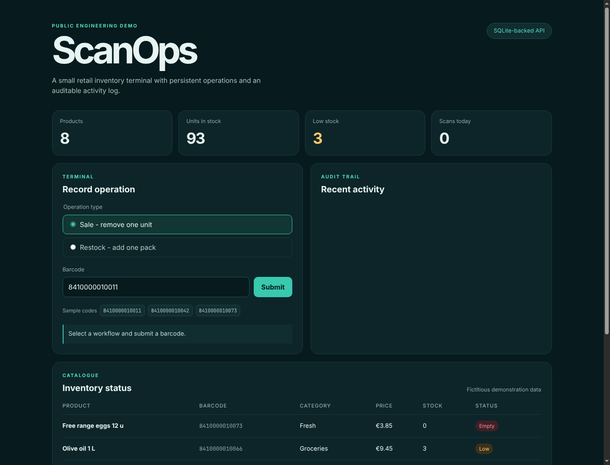

<div align="center">
  
</div>

<div align="center">
  
  
  
  
  <br/>
  <a href="README.es.md">🇪🇸 Español</a>
</div>

## Problem

Retail operators need to record high-frequency inventory movements with very little friction: scan a product, identify whether stock is leaving or arriving, and see the resulting state immediately.

**ScanOps** is a sanitized public product slice derived from that operational problem. It contains synthetic data only and does not disclose source code or data from the private original project.



## A Safe Spoiler Of What This Can Become

The public demo is intentionally small: a terminal, a catalogue and an auditable stock movement. The product opportunity behind it is much larger: a simple operational system where a small or medium business can manage products, locations, purchasing signals and daily decisions from one consistent workflow.

Not a heavy ERP that requires a specialist to operate. A product that can begin with scanning a barcode and grow with the business.

| Business context | A realistic first workflow | Where the system can grow |
|---|---|---|
| Neighbourhood grocery store or minimarket | Receive packaged goods, record sales and see low stock immediately | Supplier orders, food product enrichment, expiry alerts and margin monitoring |
| Hardware store or building-supply shop | Control hundreds or thousands of references across shelves and storage | Location transfers, purchase suggestions, slow-moving stock and team permissions |
| Fashion or accessories retailer | Count units and track sales or restocking by product variant | Multi-store catalogue, online-channel synchronisation and seasonal analysis |
| Café, bakery or specialty food shop | Keep saleable packaged products and consumables visible | Consumption forecasts, recurring purchasing and allergen/nutrition information where available |
| Small distributor or e-commerce warehouse | Maintain stock accuracy while preparing orders | Multi-terminal operations, picking flows, returns and delivery integrations |

## Product Direction

```text
Barcode / camera / terminal input
           |
           v
Unified product catalogue ---- External data enrichment
           |                   (opt-in, source-aware)
           v
Inventory event ledger ------- Reports and alerts
           |
           v
Operational assistants
(replenishment, catalogue quality, safety checks, daily briefing)
```

A future product built on this foundation could offer:

- One product catalogue that supports any number of business-owned SKUs and multiple locations.
- Purchase, sale, stock-count, transfer and return events in a single audit history.
- Lightweight device onboarding for counters, warehouses or mobile staff.
- Alerts for stock risk, data quality, unexpected movement patterns and products requiring review.
- A unified assistant layer that explains what happened and proposes actions while keeping approval with the operator.

## Data That Does Not Need To Be Typed Twice

A barcode can be the start of a richer record. These are examples of **possible integrations**, not features claimed by this demo:

| Source | Useful product opportunity | Constraint to design for |
|---|---|---|
| [Open Food Facts API](https://openfoodfacts.github.io/openfoodfacts-server/api/) | Enrich food products with public label, ingredient and nutrition information when a matching barcode exists | Community/open data must be attributed, cached responsibly and reviewed for completeness |
| [Verified by GS1](https://www.gs1.org/services/verified-by-gs1) | Validate GTIN identity and core brand/product ownership information | Public access is limited; advanced API use depends on GS1 access arrangements |
| [EU Safety Gate](https://ec.europa.eu/safety-gate/) | Help non-food retailers monitor public product-safety alerts relevant to their catalogue | Matching an alert to internal stock requires controlled review, not blind automation |

The principle is simple: request useful public or licensed information when it saves manual work, retain its source, and never silently treat third-party data as authoritative operational truth.

## Agents With A Real Job To Do

This system is a natural place for constrained agents because inventory work contains repetitive decisions backed by observable events. Examples of later modules:

| Assistant | Input it would use | Action it could prepare |
|---|---|---|
| **Catalogue onboarding assistant** | New barcode plus permitted product-data sources | Pre-fill a draft product record for human approval |
| **Replenishment assistant** | Stock history, reorder levels and pending deliveries | Suggest a purchase list before shelves run empty |
| **Safety review assistant** | Catalogue plus public safety alerts | Flag potentially relevant products for an operator to verify |
| **Daily operations brief** | Sales/restocks, low-stock items and anomalies | Produce a concise opening or closing report |

The important design rule is that an assistant may retrieve, summarise and propose; stock-changing actions remain authenticated and auditable.

## What I Built

- Responsive React and TypeScript terminal interface.
- REST API implemented with Node.js.
- SQLite persistence with transactional inventory movements.
- Demo authentication with operator, manager and read-only auditor roles.
- Sale and restock flows with validation and explicit out-of-stock rejection.
- Keyboard-scanner input plus optional browser camera barcode capture where supported.
- Recent activity audit trail and low-stock status indicators.
- Automated domain, API and UI tests, Lighthouse quality gates, CI workflow, Docker image and deployable hosted preview.

## Architecture

```text
React + TypeScript UI  ->  JSON REST API (Node.js)  ->  SQLite
```

The browser app reads the dashboard from the API and submits operational events. Each accepted scan updates stock and records its resulting state in a single transaction.

Read the design decisions in [docs/architecture.md](docs/architecture.md).

## Hosted Preview

Once GitHub Pages is enabled for this repository, the hosted interaction preview is published at:

[`https://cmesa-dev.github.io/barcode-scanner/`](https://cmesa-dev.github.io/barcode-scanner/)

GitHub Pages runs the same frontend with synthetic browser-local data. The Node.js and SQLite implementation is exercised locally or through the Docker container, because static hosting cannot operate the API service.

## Run Locally

Requires Node.js 22.5 or later because the API uses the built-in SQLite module.

```bash
npm install
npm run api
```

In a second terminal:

```bash
npm run dev
```

Open `http://localhost:5173`.

Demo accounts:

```text
operator@scanops.demo / demo-operator
manager@scanops.demo  / demo-manager
auditor@scanops.demo  / demo-auditor   (read only)
```

### Production-style run

```bash
npm run build
npm start
```

Open `http://localhost:3000`.

### Container

```bash
docker build -t scanops-demo .
docker run --rm -p 3000:3000 scanops-demo
```

## Verification

```bash
npm run check
```

The test suite covers seeded metrics, stock decrement/increment behavior, access control, rejection of impossible sales, HTTP API responses and the frontend login/operation workflow. The build performs TypeScript validation before generating frontend assets. The CI workflow runs Lighthouse against the static build with enforceable accessibility and best-practice thresholds.

## Scope Boundary

| Public implementation you can run today | Product direction intentionally previewed, not claimed as shipped |
|---|---|
| Operational UI, synthetic catalogue, REST API and SQLite event storage | Unlimited catalogue scale, multi-location and supplier purchasing |
| Demo sessions, role enforcement, sales/restocks and audit list | Production identity, tenancy and device provisioning |
| Keyboard/camera barcode input | External enrichment from Open Food Facts, GS1 or safety-alert sources |
| Automated tests, Lighthouse, Docker and CI | Constrained agents, recommendations, analytics and production monitoring |

## Next Production Iteration

For a deployed multi-terminal system I would first add authenticated device identities, idempotent event ingestion, tenant-aware permissions, offline synchronisation, migrations, monitoring and backup/restore procedures. Once the operational ledger is trustworthy, data enrichment and approval-based assistants become useful product layers rather than unsupported promises.
